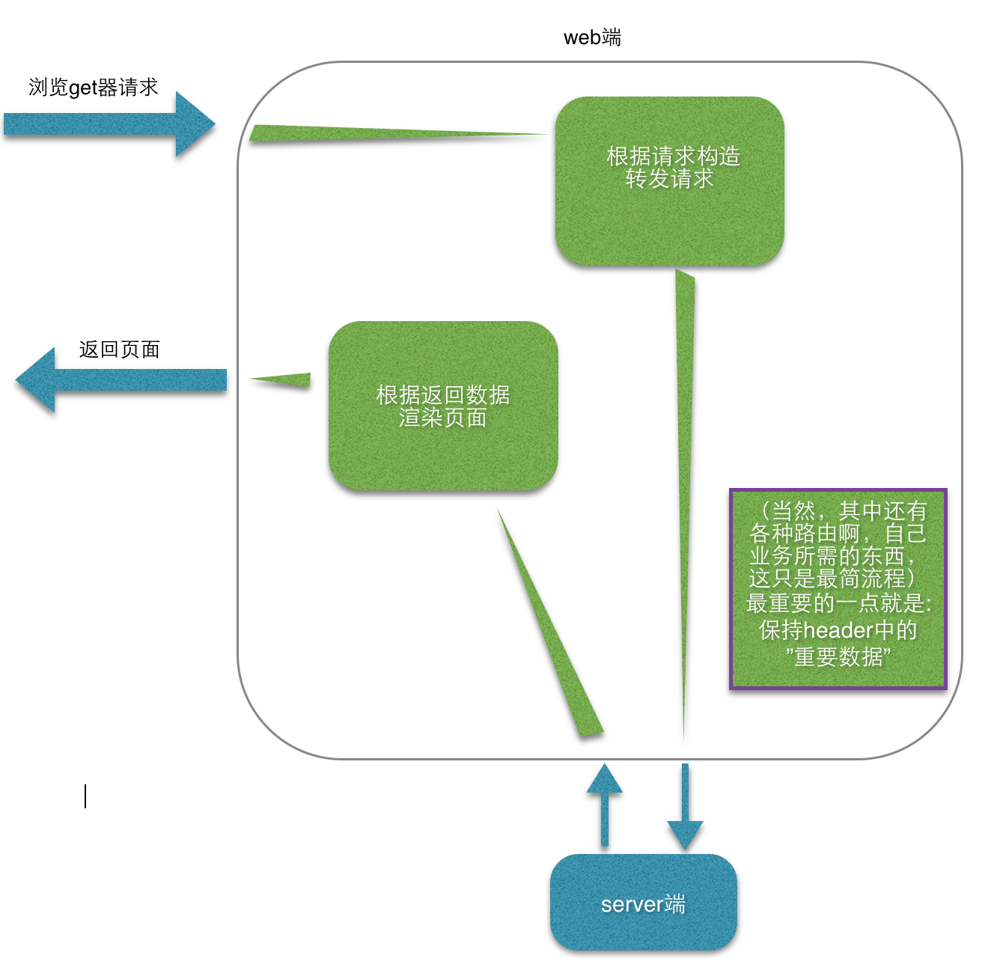

## 前后端分离

前言：
弄这个其实并不是有什么高大上的想法，只是觉得现在前端工作做得不太爽。遇到Python要怼Python模板，遇到PHP要怼PHP模板，遇到JAVA要怼JAVA模板。
一个公司里面搞这么多种后台？是的~
所以web前端就成了部门中的劳务输出，，今天跟phper玩儿，明天跟jsper玩儿，eclipse,phpstorm,PyCharm会完了，好牛逼，就是个切图滴~

咳咳。那些都是开玩笑的，咱们真正目的是前后端开发解耦，职责分离，这种高大尚的目的。
顺便把咱前端从劳务输出提升为业务承包的角色。

#### 一、要解决的问题
1. 套模板的忧桑，套各种模板，套各种后端下的模板。上线时常依赖后端（其实也有办法）。后端同学也觉得麻烦。
2. 调试，套完模板要调试。最好的办法就是吧后台环境也搭载自己的机器上，喝喝。后端同学改了点啥，你不懂一刷就报错，只有求人家后端同学，帮你一次还行，帮你一百次啊？
3. 代码复用问题，敢问a项目的模板你能拿到b项目来用吗？可以！copy过来：）a项目是php,b项目是JAVA，来呀，copy呀。小样~
4. 今天我跟后端的同学说，这个，这个，和这个页面，在后端渲染。其他的在前端渲染。后端同学心中默念，人丑多做怪，，，然后我说，要不你帮我做个bigpipe。后端同学：要啥？
要啥派？咱能不能好好把业务怼上去。别搞些有的没的~
5. 。。。。。。

#### 二、解决方案

上图：


为什么用nodejs,因为~我只会nodejs.
其实到这里，我要表达的差不多表达完了。

策略就是这么个策略，主要看怎么实现。
该解决方案，session，登录态什么的仍然是后端管理;
前端仍然只管理模板，只不过起了后台来管理模板；对后端来说，除了nginx配置改变几乎没有任何新的东西。


1、nginx配置：

```shell
  server {
      listen 80;
      server_name  proxy.test.com;
      #server_name _;

      access_log  /usr/local/var/log/nginx/proxy.xiaoying.log  main;

      #转发给web（nodejs）端
      location /webpage/ {
            proxy_pass serverHost;#服务端的请求host(包括端口号)
            proxy_set_header Host       $http_host;
            proxy_set_header X-Real-IP $remote_addr;
            proxy_set_header REMOTE-HOST $remote_addr;
            proxy_set_header   X-Forwarded-For  $proxy_add_x_forwarded_for;
      }

      #转发给server端（php、java、Python、node、c++）
      location /api/{
            proxy_pass webHost;#web端的请求host(包括端口号)
            proxy_set_header Host       $http_host;
            proxy_set_header X-Real-IP $remote_addr;
            proxy_set_header REMOTE-HOST $remote_addr;
            proxy_set_header   X-Forwarded-For  $proxy_add_x_forwarded_for;
      }
  }
```

2、web端的处理
思路：


//这是在，web与server在同一台机器上的解决办法。

```javascript

//关键之处就是我们要正确合适的传递header内容，做一个nice的proxy
function proxy(ctx, cb){//ctx是http请求中的上下文，主要为获得其中的req
    var opt = {
        host:     127.0.0.1,
        port:     serverPort,
        agent:    false,
        path:     getPath(ctx.req),
        method:   ctx.req.method,
        headers:  getHeader(ctx.req)
    };
    log('#%d\t%s http://%s%s', num, ctx.req.method, opt.host, opt.path);
    var req2 = http.request(opt, function (res2) {
        //console.log(res2);
        var serverData = '';
        res2.on('data', function (chunk) {
            //console.log('BODY: ' + chunk);
            serverData += chunk;
        });
        res2.on('end', function() {
            //回调函数，拿到server端传来的数据，选染成你想要的样子，或是直接转发给浏览器，记得setHeader
            cb(null,{data:serverData,header:res2.headers});
        })

    });
    if (/POST|PUT/i.test(ctx.req.method)) {
        ctx.req.pipe(req2);
    } else {
        req2.end();
    }
    req2.on('error', function (err) {
        log('#%d\tERROR: %s', num, err.stack);
        //res.end(err.stack);
    });
}

```

//这是在，web与server可能不在同一台机器上时。

```javascript

//关键之处就是我们要正确合适的传递header内容，做一个nice的proxy
function proxy(ctx, cb){//ctx是http请求中的上下文，主要为获得其中的req,可以稍作修改，直接传入req
    var opt = {
        host:     serverHost,
        port:     serverPort,
        agent:    false,
        path:     changPath(getPath(ctx.req)),//修改path，例如("/webpage/user_info" transport to "/api/user_info" )
        method:   ctx.req.method,
        headers:  getHeader(ctx.req)
    };
    log('#%d\t%s http://%s%s', num, ctx.req.method, opt.host, opt.path);
    var req2 = http.request(opt, function (res2) {
        //console.log(res2);
        var serverData = '';
        res2.on('data', function (chunk) {
            //console.log('BODY: ' + chunk);
            serverData += chunk;
        });
        res2.on('end', function() {
            //回调函数，拿到server端传来的数据，选染成你想要的样子，或是直接转发给浏览器，记得setHeader
            cb(null,{data:serverData,header:res2.headers});
        })

    });
    if (/POST|PUT/i.test(ctx.req.method)) {
        ctx.req.pipe(req2);
    } else {
        req2.end();
    }
    req2.on('error', function (err) {
        log('#%d\tERROR: %s', num, err.stack);
        //res.end(err.stack);
    });
}

```

3、server端的处理：
+ 不用套模板了；
+ 不用管理模板了；
+ 什么都是接口了。
+ 爽！！！


#### 三、实践样例
+ proxy.conf是nginx配置
+ /server为Server端项目
+ /webpage为web端项目

配置好nginx

```
    cd server
    npm install
    node index.js

    cd webpage
    npm install
    ndoe index.js
```

浏览器访问http://proxy.test.com/webpage/

#### 四、未实践但是可以想象的，
我们这里测试的是一对一，即一个Server一个web(因为太穷只有一台电脑，硬盘有是有128G,装不起虚拟机~),其实「一对多」或是「多对一」或是「多对多」都是可以实现的，或者是一个web集群支持所有项目web页面。
例如多个重业务逻辑的Server可以公用一个web,web根据域名做vhost；
又或是业务集中型Server，面对不同对象想使用不同web。用这种『类代理』的方式感觉可以比较好的分离前后端工作流程，解前后端工作耦合。
##### 缺点：
- 多一层的性能损耗
- 对前端要求更高了
- 不适用于业务不大或不多的情况（因为根本没人愿意配合你搞）

#### 五、balabala

以上观点，是在阅读「midway 前后端分离的思考与实践」相关文章后结合自身的不爽的自我总结与部分实践。是比较初级的实践与想法。
欢迎大家来吐槽填坑:)，有新方案的一定要联系我QQ:550281353;招聘记得发红包至微信:weivea

#### ps:现已增加php-laravel作为服务端